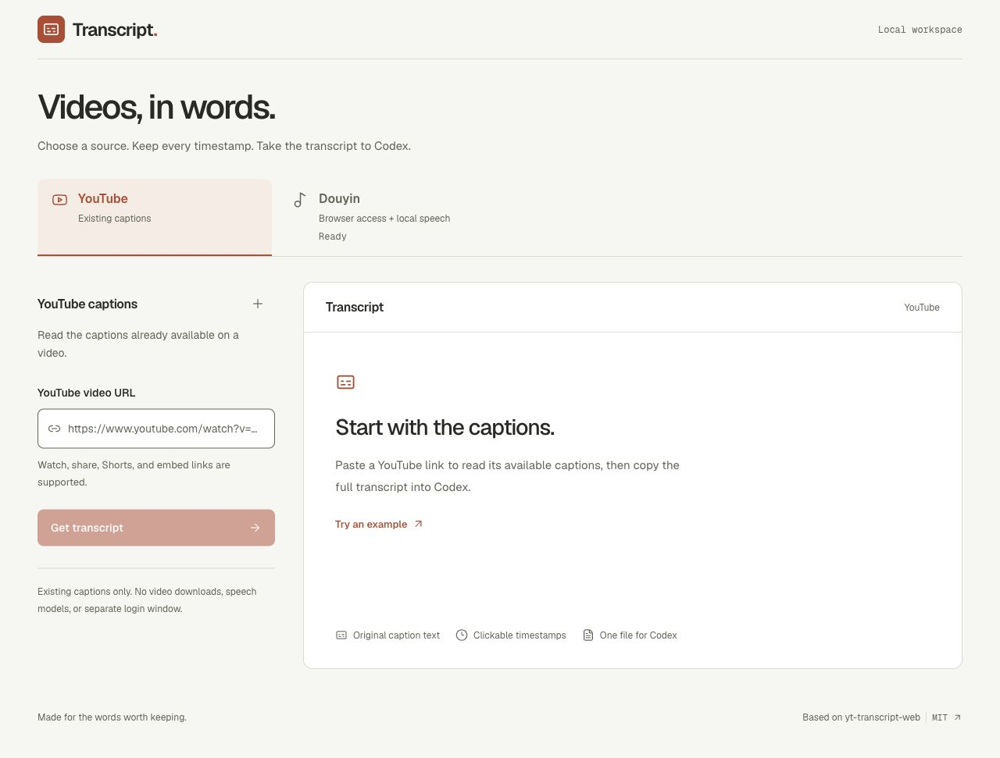
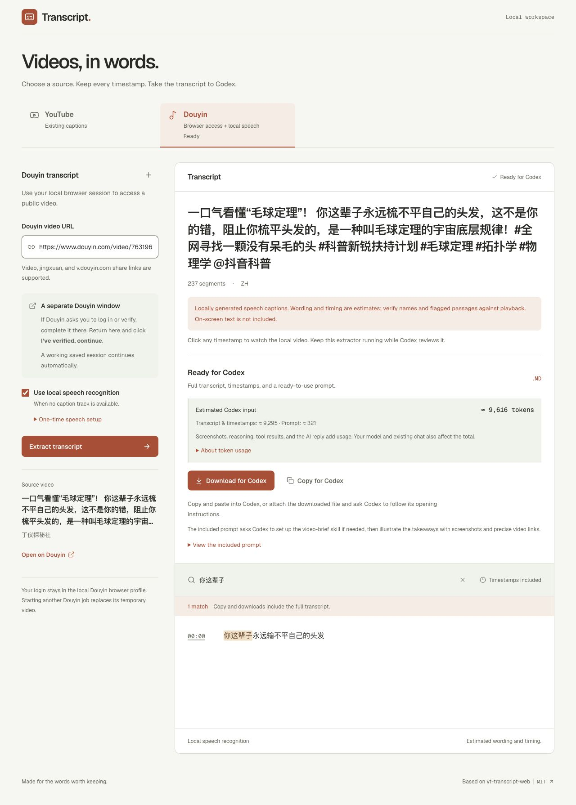

# Video Content Extractor

**Find the moments worth watching.**

Extract YouTube captions or use the local Douyin workflow, bring a timestamped transcript to Codex, and find the moments worth watching. Douyin speech extraction has been verified on four public videos; platform verification can still block other videos.

[Quick start](#quick-start) &nbsp; / &nbsp; [Douyin guide](docs/DOUYIN.md) &nbsp; / &nbsp; [See the demo](#demo-from-captions-to-a-timestamped-brief) &nbsp; / &nbsp; [Roadmap](ROADMAP.md) &nbsp; / &nbsp; [Attribution](#attribution)



Built on [samueladegoke/yt-transcript-web](https://github.com/samueladegoke/yt-transcript-web), with its MIT license preserved. Runs locally on your Mac; analysis happens in your own AI chat.

## Purpose and workflow

A long interview, lecture, or news program becomes easier to navigate when you can read a brief and open the passages that matter.

1. **Choose a channel.** Open **YouTube** for existing captions, or **Douyin** for browser access followed by captions or optional local speech recognition. Paste a link from that platform.
2. **Bring it to Codex.** Copy or download one complete Markdown transcript with every retrieved caption and its timestamps.
3. **Choose what to watch.** Use the included `video-brief` skill for an overview, key points, and links back to supporting passages.

You choose when and where to submit the transcript. The app makes no AI-service requests or automatic uploads; the Markdown also works with other assistants.

## Two channels, one handoff

| Channel | What happens after you paste a link |
| --- | --- |
| **YouTube** | Check existing caption tracks, choose the language when needed, and retrieve the transcript. No separate browser window or speech model is used. |
| **Douyin** | Open the official video in a dedicated local browser. Complete any requested login or verification there, then click **I’ve verified, continue**. A working saved session proceeds automatically. |

Each channel keeps its own link, transcript, selected language, search, and errors while the page stays open. Switching to YouTube leaves an active Douyin job running. The Douyin tab shows **Needs verification**, **Extracting**, or **Ready**, so you can see when to return. Pasting a link into the wrong channel shows a message before any extraction request is sent.



This is the real result from the [7-minute math video](https://www.douyin.com/video/7631965839184432424) tested on 2026-10-11, restored into the refined interface. Search filters the view; exports still include all **237 segments**. Wording and timing are estimated speech recognition. Source imagery and captions belong to their creators.

The page opens on YouTube. After a reload, open **Douyin** to restore its current job while the server is running. YouTube drafts and results stay in page memory and do not survive a reload. The **+** beside a channel heading starts a new transcript in that channel. Starting another Douyin extraction replaces its previous temporary video; switching channels does not. The interface follows your system's light or dark appearance and respects reduced motion.

## Demo: from captions to a timestamped brief

### Read the brief. Open the passage.

This earlier YouTube demonstration extracts **685 caption segments** from a Bloomberg Tech video. A separate Codex chat then turns that source into a timestamped brief.


The transcript stays available beside the analysis. Follow a timestamp link to check the original context or watch only a relevant section.

<details>
<summary>About this example</summary>

Both screenshots show *Anthropic Goes Big on Compute, Microsoft Rethinks AI* by Bloomberg Tech. Video imagery and caption excerpts belong to their respective owners. The summary is produced in a separate Codex chat, not inside the extractor. Current timestamp links open YouTube; seeking inside the active player is planned.

</details>

### Douyin: from manual verification to a complete handoff

The latest version also handles individual Douyin links through a dedicated local browser. Complete any login or identity check yourself on the official Douyin page, then click **I’ve verified, continue** in the extractor. That same primary button starts the remaining steps: retrieve an available caption track, or acquire the video for optional local speech recognition, then prepare the Codex file. A working saved session can proceed without another check. **Douzy is not required.**


This screenshot is from the successful **2026-10-08** test of a **31-minute** video by **毕英杰Johnathan**: **466 speech-caption segments** and approximately **19,301 input tokens**, including metadata, timestamps, and the prompt. It demonstrates extraction and handoff, not independently verified subtitles or a completed illustrated AI brief. The full transcript and downloaded video are not distributed with this repository. [Source video](https://www.douyin.com/video/7685972770793999667) · [Setup, privacy, troubleshooting, and validation](docs/DOUYIN.md).

## What works today

| What you need | What the app provides |
| --- | --- |
| YouTube source text | Uploaded or automatic captions, explicit track selection, and full-text search |
| Douyin source text | Existing captions when exposed, or optional local speech recognition after normal browser access |
| A complete AI handoff | One Markdown document with all retrieved captions, source metadata, and millisecond timings |
| Source context | Caption provenance and timing; speech-generated text is clearly labelled as estimated |
| Control over analysis | Copy/download for your own assistant, with an optional `video-brief` skill |

Copy and download always include the entire retrieved transcript, even when search filters the display. Uploaded original-language captions are preferred when that language can be determined.

### Where this is going

YouTube retrieves existing caption tracks when platform access permits. Douyin uses normal browser access and optional local speech recognition; after a requested manual check, one primary-button click runs acquisition through Codex handoff. See [Douyin setup and verification](docs/DOUYIN.md) for its tested boundaries.

The [2026-10-11 system check](VERIFICATION.md#system-check--2026-10-11) added two successful Douyin videos with matching copy/download exports and verified local seeks. All four YouTube test links received a bot-check response through the tested proxy; those runs did not retrieve captions. Offline tests and historical successes do not guarantee current live access.

| Direction | Status |
| --- | --- |
| Douyin browser acquisition + optional local speech | Verified on four public videos; other videos and real verification challenges can still fail |
| TikTok and Bilibili caption adapters | Planned |
| Browser extension beside the video player | Planned |
| Click a key point to seek the active player | Planned |

See the [Roadmap](ROADMAP.md) for scope, proposed interfaces, and contribution priorities. TikTok, Bilibili, and the extension are not implemented yet.

## Quick start

The launcher is designed for macOS. Install [uv](https://docs.astral.sh/uv/getting-started/installation/) and Node.js 22.12+ with npm, then run:

```bash
git clone https://github.com/Jack-Li-Npu/video-content-extractor.git
cd video-content-extractor
./setup.sh
./start.command
```

Open **http://127.0.0.1:8000**. Keep the terminal open while using the app; press Control-C to stop it. On subsequent macOS runs, you can double-click `start.command` in Finder.

### Enable Douyin speech recognition once

Existing YouTube captions need no speech model. To generate speech captions for Douyin videos without an exposed caption track, use an **Apple Silicon Mac**, install FFmpeg, and run the optional setup from the project folder:

```bash
brew install ffmpeg
./setup-douyin.sh
```

The script uses uv to create a separate Python 3.12 environment and downloads about **1.6 GB of pinned model weights**, with additional space needed for dependencies. Inference then runs locally. If the server is already running, stop it with Control-C and launch `./start.command` again. Intel Macs, Windows, and Linux do not currently have a supported local speech backend.

To use Douyin:

1. Open the **Douyin** tab. Paste an individual video, `jingxuan?modal_id=…`, or `v.douyin.com` share link. Leave **Use local speech recognition** checked when needed.
2. Click **Extract transcript**. Keep the dedicated browser open. If asked, complete Douyin's login, CAPTCHA, or identity verification yourself there; the extractor does not collect identity documents or solve challenges.
3. Return to the extractor and click **I’ve verified, continue** when it asks. The remaining steps run automatically. If a saved session already works, this confirmation is skipped.
4. When **Ready for Codex** appears, search the text, click a timestamp to inspect the local video, or copy/download the complete handoff. Check speech-recognition warnings before relying on names or numbers.

Keep the server running while Codex uses local video links. Starting another Douyin extraction or stopping the server removes the previous local video; downloaded transcript files remain on your computer. For retry behavior, configuration paths, and access failures, see the [Douyin guide](docs/DOUYIN.md).

### Update an existing installation

Stop the server, then run the following from your clone. Preserve any local source changes before pulling; Git will stop if they conflict.

```bash
git pull --ff-only
./setup.sh
./start.command
```

The repository was renamed from `youtube-content-extractor` to `video-content-extractor`. Existing clones can keep their local folder name. GitHub redirects the former URL; to use the current address directly, run:

```bash
git remote set-url origin https://github.com/Jack-Li-Npu/video-content-extractor.git
```

If you enable or update the optional speech runtime, run `./setup-douyin.sh` before launching. Matching model files are verified and reused instead of downloaded again. Setup preserves your existing `.env`; compare `.env.example` for new optional settings.

<details>
<summary>Setup details and download troubleshooting</summary>

Setup creates an isolated Python environment in `backend/.venv`, installs backend dependencies from `backend/uv.lock`, installs frontend dependencies with `npm ci`, and builds React for FastAPI to serve. Setup copies `.env.example` to `.env` only when `.env` does not already exist. Run setup again after changing dependencies or frontend code.

Use a regular browser for file downloads. In testing, the Codex embedded browser displayed and copied transcripts successfully but did not complete Blob downloads; **Copy for Codex** provides a complete handoff there.

</details>

### Caption selection

Paste a watch, youtu.be, Shorts, embed, live/replay link, or a video ID and click **Get transcript**. Playlist-only links and active live broadcasts are unsupported. If no original-language track is recommended, choose a caption track and submit again. Machine-translated tracks are excluded.

### Proxy configuration

The default example configuration does not force a local proxy. If your network needs one, edit `.env`:

```dotenv
YT_PROXY=http://127.0.0.1:7890
```

Use your own proxy address and keep that proxy running. Restart the app after changes. `YT_PROXY` takes priority over `HTTPS_PROXY`, `HTTP_PROXY`, and `SOCKS5_PROXY`. For direct access, leave `YT_PROXY` empty and unset those other variables. Existing shell environment variables override `.env`.

This setting covers backend YouTube requests. If npm or uv also needs a proxy, set `HTTPS_PROXY` in the terminal before running setup. YouTube extraction does not read browser cookies. Douyin uses its own dedicated browser profile; this proxy setting does not configure that browser or its media downloads.

## Use the video-brief skill

Click **Copy for Codex** and paste into your Codex chat. The copied text includes the complete transcript and a prompt that asks Codex to reuse `video-brief` if installed, or use `$skill-installer` to install it from this repository when missing. The prompt then asks Codex to read the installed instructions and continue with the transcript in the same chat. If installation is unavailable, it requests the same analysis workflow and an explicit limitation instead of assuming the skill exists.

**Download for Codex** includes the same prompt at the beginning of the `.transcript.md` file. Attach it and ask Codex to follow its opening instructions. You do not need to copy a separate setup prompt for each video. The web app itself does not install anything into Codex.

For manual installation, copy `skills/video-brief/` into `~/.agents/skills/video-brief/`. Keep only one installation; an existing copy under `~/.codex/skills/video-brief/` can also be used. Codex detects installed skills automatically; restart if it does not appear. See [Codex skill documentation](https://learn.chatgpt.com/docs/build-skills).

The brief combines captions with screenshots when they refer to charts, diagrams, or demonstrations. Visual-dependent takeaways include readable visual details and a link to a verified clear view, with a separate narration link when useful. Screenshot inspection requires available browser/screenshot tools and access to the source video; a skill provides workflow instructions, not those tools. When visual inspection is unavailable, the prompt asks for a caption-based brief that identifies the unverified visuals.

You can add a preferred language or viewing-time budget. For another assistant, provide the skill's `SKILL.md` as workflow instructions alongside the source.

The skill instructs the assistant to read every segment, verify supporting passages, attribute claims to speakers, and distinguish complete retrieved captions from complete audiovisual coverage. It cannot guarantee the accuracy of captions, visual interpretation, or an AI-generated summary.

## Token usage before you send

Each retrieved transcript shows an **estimated Codex input token count** beside the copy/download controls, with separate counts for the transcript (including metadata and timestamp formatting) and the setup prompt. Counting runs locally in a browser worker using `js-tiktoken` with the `o200k_base` reference encoding. It makes no AI-service request and uses the same complete text as copy and download, regardless of the search filter. Your selected model may tokenize it differently; this is not a bill, context-limit check, or prediction of total task usage.

Extraction makes no AI-service requests. Optional Douyin speech recognition uses local compute, not a cloud token allowance. Once you submit the handoff, Codex's existing context, skill instructions, reasoning, tool results, screenshots, and generated answer can add usage across multiple steps. Model and plan also matter; see [official Codex usage guidance](https://learn.chatgpt.com/docs/pricing). The app cannot infer your remaining allowance or turn this text estimate into a reliable price.

For a lighter first pass, add **“Give me a caption-only brief; skip screenshots.”** This still reads all captions but skips visual inspection. Attaching the downloaded file instead of pasting includes the same text and does not reduce its token count. For a very long transcript, check the selected model's context limit before submitting it.

## Source format and architecture

<details>
<summary>Explore the transcript format, project structure, and API</summary>

YouTube exports use `youtube-transcript/v1`; Douyin exports use `video-transcript/v1`. Both include a JSON metadata block with title, canonical URL, channel, language, caption source, provider, video duration, segment count, and caption coverage. Numbered headings retain start/end times as `HH:MM:SS.mmm`; text is fenced separately. Existing captions preserve their source durations and wording. Speech exports explicitly identify estimated word alignment and review flags. Unicode, line breaks, repeated captions, and overlapping cues are preserved.

```text
backend/                 FastAPI API, YouTube retrieval, Douyin jobs and speech worker
frontend/                React interface, Markdown export, locked npm dependencies
stt/                     Optional Apple Silicon speech environment and model setup
skills/video-brief/       Portable analysis instructions for a separate AI assistant
scripts/                 Export verification utility
docs/ARCHITECTURE.md      Current boundaries and proposed extension points
ROADMAP.md               Platform and browser-extension plans
```

### API

- `POST /api/video-info` with `{"url":"https://www.youtube.com/watch?v=Hrbq66XqtCo"}` returns metadata, available tracks, and a recommended track ID.
- `POST /api/extract` with `{"url":"Hrbq66XqtCo","track_id":"uploaded:en"}` retrieves the chosen track. Use a track ID returned by video-info.
- `POST /api/douyin/jobs` starts a single-link browser job; status, manual confirmation, cancellation and local playback routes are described in [docs/DOUYIN.md](docs/DOUYIN.md).
- `GET /health` reports the service status and optional local speech mode.

Transcript records include `text`, fractional `start` and `duration`, plus display `timestamp` and legacy `seconds`. The response also identifies language, source, provider, and track. Extraction failures are explicit rather than being hidden behind successful metadata retrieval.

See [docs/ARCHITECTURE.md](docs/ARCHITECTURE.md) for the proposed common platform adapter and player bridge. These are design directions, not APIs implemented today.

</details>

## Limitations and data handling

The YouTube path retrieves existing captions only and does not download media or transcribe speech. The optional Douyin path can temporarily download the requested video for local speech recognition; its separate setup downloads a pinned 1.6 GB model. Neither path translates captions, uploads media, or requires an AI API key.

YouTube supports accessible public videos with existing captions. Douyin is limited to individual videos whose normal browser playback exposes usable metadata; manual login or verification may still not resolve platform restrictions. Private, removed, restricted, sign-in-required, or captionless videos may fail. Errors distinguish invalid links, unavailable videos, missing or empty captions, blocked requests, and connection failures. YouTube can change caption access; the app does not bypass authentication or access restrictions.

The server binds to `127.0.0.1` and checks local hosts/origins. It is intended for personal local use, not public hosting. Metadata and signed caption URLs are cached in process memory for up to five minutes, with a maximum of eight videos. Transcript results stay in browser memory until copied, downloaded, replaced, or the page is closed. Thumbnails are loaded from YouTube. No transcript library or automatic upload is maintained. Douyin keeps the current job and temporary media locally until replaced or normal server shutdown; Speech failures keep the current acquired video for retry; cancelled jobs and failures without validated audio are cleared. Page reload restores the current job while the server stays running. Its dedicated login profile persists outside the repository. A forced crash can leave temporary files; see the Douyin guide for cleanup.

Captions may contain mistakes, omit visuals, or leave gaps. Follow timestamp links to check the original context before relying on an important claim. Users remain responsible for how they use and share source material.

## Development and verification

<details>
<summary>Development commands, tests, and contribution notes</summary>

After setup, run these checks from the repository root:

```bash
backend/.venv/bin/python -m pytest -q
backend/.venv/bin/ruff check backend/main.py backend/app backend/workers backend/tests tests stt/download_model.py
npm test --prefix frontend
npm run lint --prefix frontend
npm run build --prefix frontend
```

For frontend development, keep the backend running and run `npm run dev --prefix frontend -- --host 127.0.0.1`. Vite forwards local API calls to port 8000. Production uses the same origin as FastAPI.

Tests cover URL formats, selected languages and sources, provider fallback, explicit errors, timing, complete exports, source-fence handling, and disabled media downloads. See [VERIFICATION.md](VERIFICATION.md) for results and limitations. GitHub Actions runs the offline regression checks and frontend build; live YouTube access is not a CI requirement.

Contributions are welcome, particularly caption-provider adapters, player seeking, accessibility, and regression cases. See [CONTRIBUTING.md](CONTRIBUTING.md) before adding a new platform.

</details>

## Attribution

- **Application foundation:** [samueladegoke/yt-transcript-web](https://github.com/samueladegoke/yt-transcript-web), by Samuel Adegoke / Sam Ade, adapted from commit [`4928098`](https://github.com/samueladegoke/yt-transcript-web/commit/4928098ffe109df932a8f4bae47f31ebcf314a10) under the [MIT license](LICENSE). This adaptation retains its React/FastAPI foundation and caption extraction library, and changes retrieval behavior, timing, export, layout, and the AI handoff workflow. The original upstream AI/MCP services and deployment configuration are not part of this version.
- **Caption retrieval:** [jdepoix/youtube-transcript-api](https://github.com/jdepoix/youtube-transcript-api).
- **Metadata and caption fallback:** [yt-dlp/yt-dlp](https://github.com/yt-dlp/yt-dlp), used with media downloads disabled.
- **Douyin browser workflow:** [Playwright](https://github.com/microsoft/playwright-python), independently implemented using normal browser playback. The public [jiji262/douyin-downloader](https://github.com/jiji262/douyin-downloader) documentation informed the approach; neither its downloader nor Douzy is bundled or required.
- **Optional local speech:** [MLX Whisper](https://github.com/ml-explore/mlx-examples/tree/main/whisper), [MLX](https://github.com/ml-explore/mlx), the [Whisper large-v3-turbo model conversion](https://huggingface.co/mlx-community/whisper-large-v3-turbo), and separately installed [FFmpeg](https://ffmpeg.org/).
- **Frontend design guidance:** [Leonxlnx/taste-skill](https://github.com/Leonxlnx/taste-skill), especially its existing-project redesign workflow.
- **Implementation stack:** React, Vite, Tailwind CSS, FastAPI, Uvicorn, Lucide icons, and self-hosted Geist fonts. Source links and license notes are in [THIRD_PARTY_NOTICES.md](THIRD_PARTY_NOTICES.md).

The original copyright notice is preserved unchanged. Local adaptations and the video-brief skill are maintained by [Jack-Li-Npu](https://github.com/Jack-Li-Npu). This repository starts from a clean source snapshot; the upstream commit is recorded in this section rather than republishing its historical deployment files. This is an independent project, not an official YouTube, TikTok, Douyin, Bilibili, or OpenAI product.
