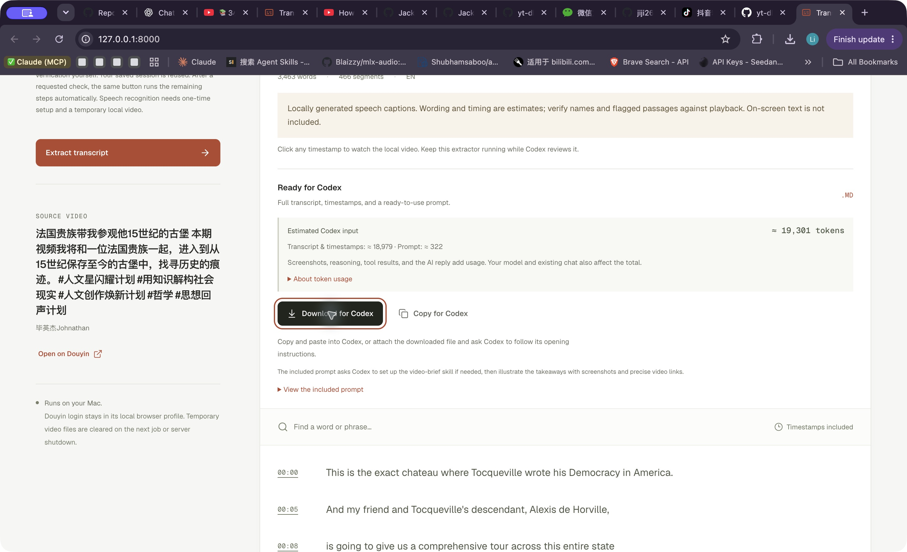
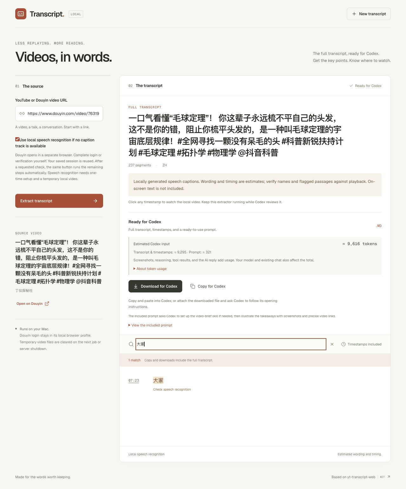
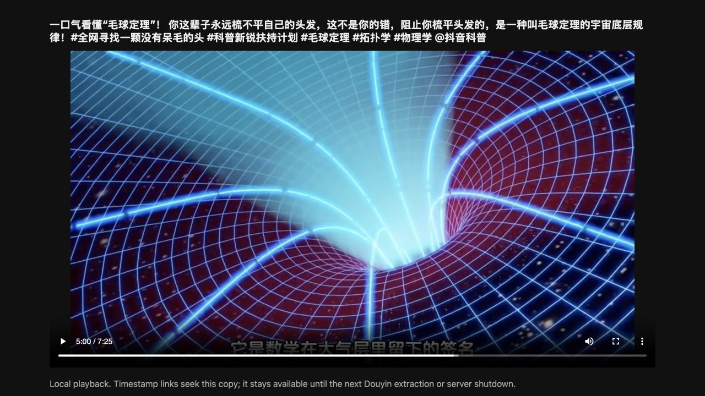

# Douyin: manual browser verification and local speech

**Verified on four public videos across 2026-10-08–11.** The latest two tests freshly acquired videos, generated 65 and 237 Chinese speech-caption segments, matched full copy/download handoffs, and displayed local frames at requested timestamps. Working saved sessions were reused. Other videos can still require manual verification or refuse access; this is not a universal downloader. See the [current system check](../VERIFICATION.md#system-check--2026-10-11).

## Use it

1. Run `./setup.sh` and `./start.command` as usual. Chrome is used when installed; setup installs Playwright Chromium otherwise. Douzy is not required.
2. For optional speech recognition on an Apple Silicon Mac, install FFmpeg (`brew install ffmpeg`) and run `./setup-douyin.sh` once. It creates a separate Python 3.12 environment, installs locked MLX dependencies, and verifies pinned Whisper large-v3-turbo model files by SHA-256. Model weights use about 1.6 GB; dependencies need additional disk space. Existing caption extraction does not need this model.
3. Paste an individual HTTPS Douyin video link, a `jingxuan?modal_id=…` link, or a `v.douyin.com` share link. Choose whether to allow local speech recognition when no caption track is found.
4. Click **Extract transcript**. A dedicated browser opens the official Douyin page and reuses its saved session. If normal playback returns this video's metadata, extraction proceeds automatically. If Douyin requires a login, CAPTCHA or identity check, complete it yourself on its official page. Then click the **same primary button**, now labelled **Verified — extract transcript**, in the extractor. Keep the browser open until acquisition finishes.
5. That one click runs the remaining pipeline. The first available platform caption track is used when exposed; otherwise, with speech recognition enabled, the app downloads the returned playback media, checks for usable audio, transcribes locally, and prepares the complete Codex handoff. The chosen language/source is recorded in the result. There is no second Continue button, download-tool handoff, or required reply to Codex. Douyin does not currently have a separate language picker; YouTube keeps its selected-track workflow.
6. The progress panel shows access, acquisition, speech recognition and handoff preparation. Reloading the page restores the current job while the server remains running. If speech processing fails after acquisition, **Retry speech recognition** reuses that video without a new browser session or download. Other failures show **Retry extraction**. **Error details** exposes a safe error code and worker exit number, never a raw traceback or browser secrets.
7. Search, click a timestamp, or **Copy for Codex** / **Download for Codex**. Speech text and word timing are estimates. Check names, numbers and flagged cues; no on-screen translations or scene text are recovered. The app prepares the handoff; you submit it in your Codex chat.

The local player supports fractional `#t=SECONDS` jumps and HTTP range playback. Keep the extractor running on the same computer while Codex inspects screenshots. The local player expires when another Douyin job starts or the server stops. Local links do not work for someone else on GitHub. Public Douyin links are preserved for attribution; exact seeking on those links is not claimed.

## Example result

This real 2026-10-08 result contains **466 segments** from a 31-minute public video. The approximately **19,301-token** estimate covers the full exported text and prompt; subsequent Codex reasoning, tool calls, screenshots, and replies add usage. Copy and download include every segment even when search shows only a few. The screenshot demonstrates the extractor's output, not the correctness of every recognized word. Video and caption excerpts belong to their respective owners. The media, complete transcript, login profile, and worker logs are excluded from the repository.

### Additional video checks — 2026-10-11

This [7-minute source video](https://www.douyin.com/video/7631965839184432424) produced **237 segments** and an approximately **9,616-token** handoff. Search shows one matching cue, while copy/download retain all 237. Its long Chinese title exposed a filename-length bug; the corrected download was compared byte-for-byte with the full copied transcript. No complete transcript is distributed here.

The local player was inspected at **152.300 and 300.500 seconds**. A second [3-minute physics video](https://www.douyin.com/video/7687991485467966031) produced **65 segments**, with complete copy/download comparison and inspected frames at **36.280 and 95.800 seconds**. These checks establish local seeking and handoff completeness, not exact ASR accuracy or the first appearance of a visual. Source imagery and captions belong to their creators. The screenshot's local link is not a live video hosted by this repository.

## Troubleshooting

| What you see | What to do |
| --- | --- |
| A Douyin login, CAPTCHA, or identity prompt | Complete it yourself in the dedicated official-page browser. Return and click **Verified — extract transcript**. Use **Show Douyin window** if it is behind another window. Do not paste credentials or ID documents into this app or Codex. |
| `douyin_verification_blocked` after confirming | Check that the exact video plays in the dedicated browser. Retry extraction if appropriate; verification may still not grant access, and this app cannot bypass that restriction. |
| `speech_setup_required`, `speech_runtime_missing`, or `model_missing` | On Apple Silicon, install FFmpeg and run `./setup-douyin.sh` from the project root. Check any custom `STT_PYTHON` / `STT_MODEL_DIR` paths. Restart after changing `.env`, then use the displayed retry action. |
| Speech processing fails after the video was acquired | Click **Retry speech recognition**. This reuses validated media; no new browser login or download is needed. The current failed job is retained only until replaced or shutdown. |
| `no_audio`, refused media, or a connection failure | Follow the error message and use **Retry extraction**. Alternate returned playback variants are tried automatically; not every video exposes usable media. |
| No captions and speech recognition is off | Enable local speech recognition after its one-time setup and retry. Burned-in subtitles are pixels, not an exposed caption track; OCR is not implemented. |
| Progress disappears after reloading | Reload restores only the current job in the same running server. A restart clears jobs. Starting another extraction replaces the previous one. |
| A local timestamp link is missing or expired | Local playback exists only when this job acquired media. Keep that server/job running on the same computer. A caption-only Douyin result retains its public source URL but has no local video to seek. |
| Codex cannot open the player or capture screenshots | Check that Codex has browser/screenshot tools and can access localhost on this computer. The skill cannot grant those capabilities. Ask for a caption-only brief and identify the unverified visuals; do not treat caption positions as verified visual timestamps. |
| Downloads do not complete | Update the app if a long Chinese/emoji title caused the failure; filenames now respect common byte limits. If your embedded browser still prevents downloads, use **Copy for Codex** or open the extractor in a regular browser. Both handoffs contain the same full text. |

Selecting **New transcript** starts a new form; the previous Douyin media is removed when a new Douyin job actually starts, or when the server stops. Save any transcript you want to keep before replacing the result.

## Acquisition boundaries

The app observes matching public video metadata returned during normal webpage playback, then uses media/caption addresses that response actually contains. It does not forge signatures, replay private desktop code, solve challenges automatically, scrape account lists, or import cookies from Douzy or another browser profile. It processes one individual video at a time.

The [upstream downloader](https://github.com/jiji262/douyin-downloader) documents CLI API-request verification failures and describes a desktop browser bridge in its [maintainer instructions](https://github.com/jiji262/douyin-downloader/blob/main/AGENTS.md). That supports trying normal browser playback; it does not establish a blanket project ban or guarantee this implementation works for every video. Manual login alone may not remove a request restriction. This integration is independent code using [Playwright network observation](https://playwright.dev/python/docs/network), not a bundled copy of Douzy.

## Local data and setup

- Login stays in `~/.local/share/efficient-content-extractor/douyin-browser/`, a dedicated Chromium profile with owner-only directory permissions. Browser cookies needed for the returned media address may be used in memory for that download; values are never exported to the transcript or logged. The app does not store an ID document or ask for credentials in its UI.
- Temporary media, worker logs and transcript output are placed in an owner-only `transcript-douyin-*` directory under the OS temporary folder. A speech failure keeps the current acquired video and worker log for retry. Jobs without validated audio and cancelled jobs are cleared. A completed job is kept for local playback. The next job or normal shutdown clears the previous job, including failed retry data. A forced crash can leave these directories. Inspect and remove only this app's temporary directories if cleanup is needed.
- The model persists in `~/.cache/efficient-content-extractor/models/whisper-turbo/`. Inference uses local model files with Hugging Face offline mode; setup downloads model data separately. The app makes no cloud AI request or automatic upload.
- `.env` can override `DOUYIN_BROWSER_PROFILE`, `STT_PYTHON`, and `STT_MODEL_DIR` with absolute paths. Restart after changes. `STT_PYTHON`, if set, must point to the virtual environment executable (for example `/absolute/path/to/project/stt/.venv/bin/python`), not its resolved base-Python symlink target. The app checks MLX availability before acquisition. Do not point the browser profile at your everyday Chrome or Douzy data directory. Close its browser before removing the dedicated profile to sign out locally.
- YouTube retrieval remains caption-only. Douyin speech recognition currently requires Apple Silicon, Python 3.12 and FFmpeg; no Windows/Linux ASR backend is implemented.

## API and states

`POST /api/douyin/jobs` accepts `{"url":"https://www.douyin.com/video/7685972770793999667","allow_asr":true}`. It returns an unpredictable local job ID. Poll `GET /api/douyin/jobs/{id}`. `GET /api/douyin/current-job` restores the current job/result after a page reload. POST `{}` to `/confirm` only after a requested manual check, `/show-browser` to bring that waiting window forward, `/retry-speech` to reuse a failed job's validated media, or `/cancel` to stop the job. The current completed job exposes `/viewer` and `/video` when local media exists; the video endpoint supports range requests. Only one job is retained; a server restart clears jobs.

States: `opening_browser → reading_video → waiting_verification (only when needed) → reading_video → downloading_captions` or `downloading_media → transcribing → completed`. Failed speech jobs can return to `transcribing` through retry; cancellation ends a job. Errors distinguish invalid links, busy jobs, inaccessible playback metadata, absent/invalid captions, rejected media addresses, refused downloads, network failures, incomplete runtime/model setup, audio-less media, decoding failures, invalid speech timing, and speech processing failure. Browser challenges time out after 15 minutes; speech jobs after one hour. Media is limited to 1 GiB and caption files to 10 MiB. Returned video variants are tried automatically if acquisition or the audio check fails.

`manual_verification_confirmed` means the user clicked the primary button after a requested manual check in this job. It is false when a saved browser session works directly. Neither value certifies identity or proves Douyin performed an identity check.

## Validation record

- System check on 2026-10-11: **88 backend tests, five multilingual subcases and 16 frontend tests** passed, plus lint/build, shell syntax and locked-dependency checks. Two additional videos freshly completed ASR and browser copy/download comparison; source frames and fractional local seek positions were inspected. The 21-minute Chinese failure was also corrected and retried successfully with **605 segments** on 2026-10-10. See [VERIFICATION.md](../VERIFICATION.md) for the complete matrix, YouTube blocked-request results, and limits.
- Release checks on 2026-10-10: **86 backend tests and 15 frontend tests** passed; Ruff, ESLint, the frontend production build and shell syntax checks passed. Regressions include normal saved-session playback, one manual confirmation through caption completion, automatic fallback to a media variant with audio, safe worker diagnostics, speech retry without reopening the browser, reload status, origin checks, range playback, accurate exports, and existing YouTube extraction behavior. These offline checks do not perform real identity verification or download media/model weights.
- Live test: video `7685972770793999667` was freshly acquired through this adapter as a 1280×720 video with audio (90,670,052 bytes; duration 1,891.861 seconds). No old Douzy copy was used. Offline MLX Whisper large-v3-turbo produced 466 cues in 88.3 seconds, including audio extraction but excluding download time, with about 3.14 GiB peak MLX allocation. This is a sample, not an accuracy or speed guarantee.
- First cue: `00:00:00.000–00:00:04.440`; last cue: `00:31:24.240–00:31:25.260`. The final seconds contain no additional recognized cue. The transcript is recognized speech, not verified original subtitles; 138 cues were flagged for review. Names, foreign phrases, music and silence still need checking.
- Browser verification: the running job survived a page reload; the result displayed 466 segments; Copy for Codex and both browser-downloaded Markdown files matched the full export exactly. A clicked `06:42` link opened the local player at `402.480` seconds, with the expected source frame and playable video. The handoff estimate displayed approximately 19,301 input tokens, excluding later AI/tool/image usage.
- The live test exposed an interpreter configuration failure (`mlx` absent from base Python). The runtime path was corrected to the isolated virtual environment, and a preflight check now detects missing MLX before download. Synthetic tests verify that failures after acquisition retain the video for direct speech retry.
- Live verification did not trigger a new identity challenge because the existing session worked. The manual pause/confirm path is covered by offline regression tests; users must still perform real site challenges themselves. The later two-video check above adds sample coverage, not universal access or live confirmation of every caption schema and URL type.

Future work includes broader caption schemas, music/silence handling, portable speech backends, importing a user-selected local file, and an extension that seeks the original active player. These are not shipped features.
